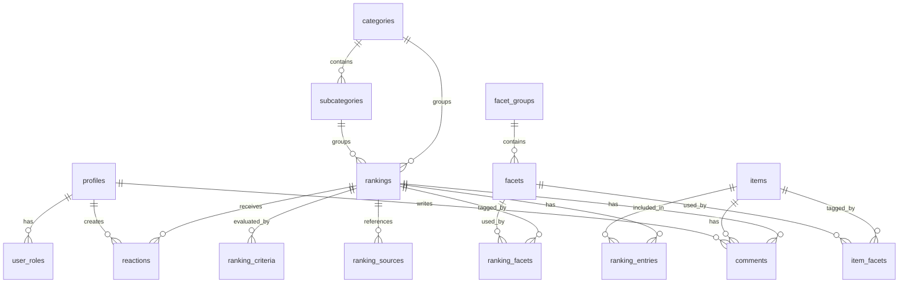

# 랭킹위키 DB ERD 문서 v0.1

## 0. 문서 목적

이 문서는 랭킹위키 MVP의 데이터 구조를 정의하기 위한 DB ERD 문서다.

이 문서는 Usecase 문서에서 확정한 다음 원칙을 데이터 모델로 옮긴다.

- 서비스 중심은 커뮤니티가 아니라 랭킹 문서다.
- Category와 Facet은 역할을 분리한다.
- Ranking은 반드시 Scope와 선정 기준을 가진다.
- MVP의 핵심은 관리자가 랭킹 문서를 빠르게 만들고 발행하는 흐름이다.

이 문서에서는 다음을 다룬다.

- 핵심 엔티티
- 테이블 관계
- MVP 필수 테이블
- 향후 확장 테이블
- 주요 필드
- 관계 설계 원칙

이 문서에서는 다음을 자세히 다루지 않는다.

- 실제 SQL 마이그레이션
- API 설계
- 화면 컴포넌트 설계
- 구현 일정
- 크롤링 파이프라인
- 서버 액션/라우트 구현

---

## 1. 데이터 모델 핵심 원칙

### 1.1 랭킹 문서 중심 구조

랭킹위키의 중심 테이블은 `rankings`다.

랭킹은 단순 제목과 본문만 가진 글이 아니라 다음 정보를 함께 가진다.

- 어떤 카테고리에 속하는가
- 어떤 서브카테고리에 속하는가
- 어떤 후보군 Scope에서 나온 순위인가
- 어떤 기준으로 순위를 정했는가
- 어떤 아이템들이 몇 위로 들어가는가
- 각 아이템이 왜 해당 순위인가
- 발행 상태가 무엇인가

---

### 1.2 Category와 Facet은 분리한다

Category/Subcategory는 사이트의 큰 탐색 구조다.

Facet은 조건 필터다.

예시:

```txt
Category: 콘텐츠
Subcategory: 웹툰
Facet Group: platform
Facet Value: 네이버

Facet Group: genre
Facet Value: 로맨스
```

즉, `네이버`, `로맨스`, `완결` 같은 조건을 카테고리 트리에 밀어 넣지 않는다.

---

### 1.3 Ranking Scope는 랭킹의 후보군을 설명한다

Ranking Scope는 특정 랭킹이 어떤 후보군에서 TOP 5 또는 TOP 10을 뽑았는지 설명하는 구조다.

예시:

```txt
랭킹명: 네이버 완결 로맨스 웹툰 TOP 10

Scope:
- Category: 콘텐츠
- Subcategory: 웹툰
- platform: 네이버
- genre: 로맨스
- status: 완결
```

MVP에서는 Ranking Scope를 `rankings.scope_json`에 저장하고, 필요해지면 별도 정규화 테이블로 분리할 수 있다.

---

### 1.4 Ranking Entry가 순위의 핵심이다

`ranking_entries`는 `rankings`와 `items`를 연결하는 중간 테이블이다.

단순 연결 테이블이 아니라 다음 의미를 가진다.

- 이 아이템이 이 랭킹에서 몇 위인가
- 왜 이 순위인가
- 에디터 점수는 얼마인가
- 스폰서 표시가 필요한가
- 기준별 점수 또는 내부 메모가 있는가

---

## 2. ERD 개요



---

## 3. MVP 필수 테이블

MVP에서 필요한 최소 테이블은 다음과 같다.

```txt
profiles
user_roles

categories
subcategories

facet_groups
facets

items
rankings
ranking_entries

ranking_facets
item_facets

ranking_criteria
ranking_sources
```
> `ranking_sources`는 P0에서 테이블은 만들되, 랭킹 발행 필수 입력값으로 강제하지 않는다.  
> 초기에는 출처 URL이 없을 수 있으므로, 근거 메모 또는 참고 기준을 선택 입력으로 둔다.

P1 이후 추가 또는 활성화할 테이블:

```txt
reactions
comments
```

P2 이후 확장 후보:

```txt
ranking_snapshots
sponsor_slots
import_jobs
external_sources
moderation_logs
user_votes
```

---

## 4. 사용자/권한 테이블

### 4.1 profiles

Supabase Auth 사용자와 연결되는 프로필 테이블이다.

| 필드 | 타입 | 설명 |
|---|---|---|
| id | uuid PK | auth.users.id와 연결 |
| display_name | text | 표시 이름 |
| avatar_url | text nullable | 프로필 이미지 |
| created_at | timestamptz | 생성일 |
| updated_at | timestamptz | 수정일 |

### 관계

```txt
profiles 1:N user_roles
profiles 1:N comments
profiles 1:N reactions
```

---

### 4.2 user_roles

관리자, 에디터 등 운영 권한을 관리한다.

| 필드 | 타입 | 설명 |
|---|---|---|
| id | uuid PK | 역할 row id |
| user_id | uuid FK | profiles.id |
| role | text | admin, editor, user |
| created_at | timestamptz | 생성일 |

### 권장 role

| role | 설명 |
|---|---|
| admin | 전체 관리 |
| editor | 랭킹/아이템 작성 |
| user | 일반 사용자 |

MVP에서는 `admin`만 있어도 된다.

---

## 5. 분류 구조 테이블

### 5.1 categories

사이트의 최상위 주제 분류다.

| 필드 | 타입 | 설명 |
|---|---|---|
| id | uuid PK | 카테고리 id |
| name | text | 카테고리명 |
| slug | text unique | URL용 slug |
| description | text nullable | 설명 |
| is_visible | boolean | 공개 여부 |
| sort_order | integer | 정렬 순서 |
| created_at | timestamptz | 생성일 |
| updated_at | timestamptz | 수정일 |

### 예시

```txt
식품
콘텐츠
게임
영화
교육
인물
```

---

## 5.2 subcategories

카테고리 아래의 구체 영역이다.

| 필드 | 타입 | 설명 |
|---|---|---|
| id | uuid PK | 서브카테고리 id |
| category_id | uuid FK | categories.id |
| name | text | 서브카테고리명 |
| slug | text | URL용 slug |
| description | text nullable | 설명 |
| is_visible | boolean | 공개 여부 |
| sort_order | integer | 정렬 순서 |
| created_at | timestamptz | 생성일 |
| updated_at | timestamptz | 수정일 |

### 제약

```txt
UNIQUE(category_id, slug)
```

### 예시

```txt
식품 > 닭가슴살
식품 > 단백질 보충제
콘텐츠 > 웹툰
콘텐츠 > 영화
```

---

## 6. Facet 구조 테이블

### 6.1 facet_groups

Facet의 성격을 구분하는 그룹이다.

| 필드 | 타입 | 설명 |
|---|---|---|
| id | uuid PK | Facet group id |
| code | text unique | platform, genre, brand 등 |
| name | text | 표시명 |
| description | text nullable | 설명 |
| applies_to | text nullable | ranking, item, both |
| created_at | timestamptz | 생성일 |
| updated_at | timestamptz | 수정일 |

### 예시

| code | name |
|---|---|
| platform | 플랫폼 |
| genre | 장르 |
| brand | 브랜드 |
| form | 형태 |
| purpose | 목적 |
| status | 상태 |

---

### 6.2 facets

실제 Facet 값이다.

| 필드 | 타입 | 설명 |
|---|---|---|
| id | uuid PK | Facet id |
| facet_group_id | uuid FK | facet_groups.id |
| name | text | Facet명 |
| slug | text | URL용 slug |
| description | text nullable | 설명 |
| created_at | timestamptz | 생성일 |
| updated_at | timestamptz | 수정일 |

### 제약

```txt
UNIQUE(facet_group_id, slug)
```

### 예시

```txt
platform: 네이버, 카카오, 리디
genre: 로맨스, 공포, 액션
brand: 한끼통살, 허닭, 랭커
form: 수비드, 훈제, 볼, 스테이크
purpose: 가성비, 다이어트용, 맛있는
status: 완결, 연재중, 판매중
```

---

## 7. 아이템 테이블

### 7.1 items

랭킹에 포함되는 개별 항목이다.

| 필드 | 타입 | 설명 |
|---|---|---|
| id | uuid PK | 아이템 id |
| title | text | 아이템명 |
| slug | text unique | URL용 slug |
| description | text nullable | 설명 |
| item_type | text | food, supplement, webtoon 등 |
| image_url | text nullable | 이미지 |
| brand_or_creator | text nullable | 브랜드/제작자 |
| external_url | text nullable | 외부 링크 |
| affiliate_url | text nullable | 제휴 링크 |
| status | text | active, hidden, archived |
| metadata | jsonb | 확장 데이터 |
| created_at | timestamptz | 생성일 |
| updated_at | timestamptz | 수정일 |

### item_type 예시

| item_type | 설명 |
|---|---|
| food | 식품 |
| supplement | 보충제 |
| webtoon | 웹툰 |
| movie | 영화 |
| game | 게임 |
| person | 인물 |
| brand | 브랜드 |

### slug 정책

MVP에서는 `items.slug`를 전역 unique로 둔다.

즉, 아이템 URL은 `/items/[slug]` 구조를 기본으로 한다.

향후 아이템 유형별 URL 구조가 필요해지면 다음 정책으로 전환할 수 있다.

```txt
UNIQUE(item_type, slug)
```

---

### 7.2 item_facets

아이템과 Facet을 연결한다.

| 필드 | 타입 | 설명 |
|---|---|---|
| item_id | uuid FK | items.id |
| facet_id | uuid FK | facets.id |
| created_at | timestamptz | 생성일 |

### 제약

```txt
PRIMARY KEY(item_id, facet_id)
```

### 예시

```txt
한끼통살 수비드 닭가슴살
- brand: 한끼통살
- form: 수비드
- purpose: 맛있는
```

---

## 8. 랭킹 테이블

### 8.1 rankings

실제 랭킹 문서다.

| 필드 | 타입 | 설명 |
|---|---|---|
| id | uuid PK | 랭킹 id |
| category_id | uuid FK | categories.id |
| subcategory_id | uuid FK nullable | subcategories.id |
| title | text | 랭킹 제목 |
| slug | text unique | URL용 slug |
| summary | text | 요약 |
| body | text nullable | 본문 설명 |
| ranking_type | text | editor_pick, popularity 등 |
| scope_json | jsonb | 후보군 범위 |
| status | text | draft, published, archived |
| featured | boolean | 대표 노출 여부 |
| cover_image_url | text nullable | 커버 이미지 |
| seo_title | text nullable | SEO 제목 |
| seo_description | text nullable | SEO 설명 |
| published_at | timestamptz nullable | 발행일 |
| created_by | uuid FK | profiles.id |
| updated_by | uuid FK nullable | profiles.id |
| created_at | timestamptz | 생성일 |
| updated_at | timestamptz | 수정일 |

### ranking_type 예시

| ranking_type | 설명 |
|---|---|
| editor_pick | 운영자 선정 |
| popularity | 인기 기반 |
| quality | 품질 기반 |
| purpose | 목적 기반 |
| user_vote | 유저 투표 기반 |
| sponsored | 스폰서 기반 |

### scope_json 예시

```json
{
  "category": "식품",
  "subcategory": "닭가슴살",
  "form": "수비드",
  "purpose": "맛"
}
```

### 발행 조건

MVP 기준으로 published 상태 전환 시 다음 정보가 필요하다.

```txt
title
category_id
summary
ranking_type
scope_json
ranking_entries 1개 이상
ranking_criteria 1개 이상
ranking_sources는 선택 입력
```

### Category/Subcategory 정합성 원칙

Ranking이 `subcategory_id`를 가질 경우, 해당 Subcategory의 `category_id`는 `rankings.category_id`와 반드시 일치해야 한다.

예를 들어 `rankings.category_id = 식품`인데 `subcategory_id = 웹툰`이 들어가면 안 된다.

이 정합성은 구현 단계에서 DB constraint, trigger, 또는 애플리케이션 validation으로 보장한다.

---

### 8.2 ranking_entries

랭킹과 아이템을 연결하고 순위 정보를 저장한다.

| 필드 | 타입 | 설명 |
|---|---|---|
| id | uuid PK | 엔트리 id |
| ranking_id | uuid FK | rankings.id |
| item_id | uuid FK | items.id |
| position | integer | 순위 |
| reason | text | 선정 이유 |
| editor_score | numeric nullable | 운영자 점수 |
| score_json | jsonb nullable | 기준별 점수 |
| internal_note | text nullable | 내부 메모 |
| sponsor_flag | boolean | 스폰서 여부 |
| metadata | jsonb | 확장 데이터 |
| created_at | timestamptz | 생성일 |
| updated_at | timestamptz | 수정일 |

### 제약

```txt
UNIQUE(ranking_id, position)
UNIQUE(ranking_id, item_id)
```

### score_json 예시

```json
{
  "scores": [
    {
      "criterion": "맛/식감",
      "score": 8.5,
      "weight": 30,
      "note": "식감 평가가 안정적임"
    },
    {
      "criterion": "가격/가성비",
      "score": 7.8,
      "weight": 20,
      "note": "할인 접근성이 높음"
    }
  ]
}
```

MVP에서는 `editor_score`와 `score_json`을 선택 입력으로 둔다.

---

### 8.3 ranking_facets

랭킹과 Facet을 연결한다.

| 필드 | 타입 | 설명 |
|---|---|---|
| ranking_id | uuid FK | rankings.id |
| facet_id | uuid FK | facets.id |
| created_at | timestamptz | 생성일 |

### 제약

```txt
PRIMARY KEY(ranking_id, facet_id)
```

### 예시

```txt
맛있는 수비드 닭가슴살 TOP 10
- form: 수비드
- purpose: 맛있는
```

### scope_json과 ranking_facets의 역할

`scope_json`은 랭킹의 후보군 범위를 설명하는 스냅샷이다.

`ranking_facets`는 검색, 필터, 내부 연결에 쓰는 정규화된 조건 연결이다.

두 값은 같은 의미를 가질 수 있으나 역할은 다르다.

- `scope_json` = 사람이 읽는 후보군 설명과 유연한 확장용
- `ranking_facets` = 실제 필터링, 검색, 내부 연결용

공개 탐색과 필터링의 기준은 `ranking_facets`를 우선한다.
---

### 8.4 ranking_criteria

랭킹의 선정 기준을 저장한다.

| 필드 | 타입 | 설명 |
|---|---|---|
| id | uuid PK | 기준 id |
| ranking_id | uuid FK | rankings.id |
| name | text | 기준명 |
| description | text nullable | 기준 설명 |
| weight | numeric nullable | 가중치 |
| sort_order | integer | 표시 순서 |
| created_at | timestamptz | 생성일 |
| updated_at | timestamptz | 수정일 |

### 예시

```txt
맛/식감 30
가격/가성비 20
리뷰/인지도 15
구매 접근성 10
```

MVP에서는 기준 설명만 있어도 되고, 가중치는 선택값으로 둘 수 있다.

---

### 8.5 ranking_sources

랭킹 작성 시 참고한 출처 또는 근거를 저장한다.

| 필드 | 타입 | 설명 |
|---|---|---|
| id | uuid PK | 출처 id |
| ranking_id | uuid FK | rankings.id |
| label | text | 출처명 |
| url | text nullable | URL |
| source_type | text nullable | review, official, community, internal 등 |
| note | text nullable | 내부 또는 공개 메모 |
| is_public | boolean | 공개 여부 |
| created_at | timestamptz | 생성일 |

### 예시

```txt
공개 리뷰 수
제품 스펙
플랫폼 인기 순위
운영자 테스트
커뮤니티 언급량
```

---

## 9. P1 테이블

### 9.1 reactions

랭킹에 대한 가벼운 유저 반응을 저장한다.

| 필드 | 타입 | 설명 |
|---|---|---|
| id | uuid PK | 반응 id |
| user_id | uuid FK | profiles.id |
| ranking_id | uuid FK | rankings.id |
| reaction_type | text | agree, disagree 등 |
| created_at | timestamptz | 생성일 |

### reaction_type 예시

| reaction_type | 표시 |
|---|---|
| agree | 인정 |
| disagree | 비인정 |
| tried | 써봤어요 |
| watching | 보고 있어요 |
| change_needed | 순위 바꿔야 함 |
| curious | 궁금해요 |

### 중복 정책 후보

```txt
UNIQUE(user_id, ranking_id, reaction_type)
```

또는

```txt
UNIQUE(user_id, ranking_id)
```

MVP 이후 정책에 따라 선택한다.

---

### 9.2 comments

랭킹 또는 아이템에 달리는 댓글이다.

| 필드 | 타입 | 설명 |
|---|---|---|
| id | uuid PK | 댓글 id |
| user_id | uuid FK | profiles.id |
| ranking_id | uuid FK nullable | rankings.id |
| item_id | uuid FK nullable | items.id |
| parent_id | uuid nullable | 향후 대댓글용 |
| body | text | 댓글 내용 |
| status | text | visible, hidden, deleted |
| created_at | timestamptz | 생성일 |
| updated_at | timestamptz | 수정일 |

### 제약

댓글은 ranking 또는 item 중 하나에 연결되어야 한다.

```txt
CHECK (
  (ranking_id IS NOT NULL AND item_id IS NULL)
  OR
  (ranking_id IS NULL AND item_id IS NOT NULL)
)
```

MVP 이후에는 `parent_id`를 사용해 대댓글을 열 수 있다.

---

## 10. P2 확장 테이블

### 10.1 ranking_snapshots

랭킹 변경 이력을 저장한다.

용도:

- 과거 순위 보존
- 순위 변동 표시
- 위키형 신뢰도 강화

---

### 10.2 sponsor_slots

스폰서 추천 영역을 관리한다.

용도:

- 광고 영역 분리
- 일반 순위와 스폰서 분리
- 수익화 상품 관리

---

### 10.3 import_jobs

반자동 import 또는 크롤링 작업 상태를 저장한다.

용도:

- 외부 데이터 수집 기록
- 실패 로그
- 승인 대기 상태
- 관리자가 검수 후 반영

---

### 10.4 external_sources

외부 데이터 출처를 관리한다.

용도:

- 수집 출처 관리
- 신뢰도 점수
- robots/policy 메모
- 데이터 갱신 주기 관리

---

### 10.5 moderation_logs

관리자 조치 이력을 저장한다.

용도:

- 댓글 숨김
- 댓글 삭제
- 유저 제재
- 운영 감사 로그

---

## 11. 핵심 관계 요약

### 11.1 Category 관계

```txt
categories 1:N subcategories
categories 1:N rankings
subcategories 1:N rankings
```

---

### 11.2 Facet 관계

```txt
facet_groups 1:N facets
facets N:M rankings through ranking_facets
facets N:M items through item_facets
```

---

### 11.3 Ranking 관계

```txt
rankings 1:N ranking_entries
rankings 1:N ranking_criteria
rankings 1:N ranking_sources
rankings N:M facets through ranking_facets
```

---

### 11.4 Item 관계

```txt
items 1:N ranking_entries
items N:M facets through item_facets
```

---

### 11.5 User 관계

```txt
profiles 1:N user_roles
profiles 1:N rankings as created_by
profiles 1:N comments
profiles 1:N reactions
```

---

## 12. 인덱스 권장사항

### 12.1 slug 인덱스

```txt
categories.slug
subcategories.category_id + subcategories.slug
items.slug
rankings.slug
```

---

### 12.2 공개 목록 조회 인덱스

```txt
rankings.status
rankings.category_id
rankings.subcategory_id
rankings.featured
rankings.published_at
```

---

### 12.3 순위표 조회 인덱스

```txt
ranking_entries.ranking_id
ranking_entries.ranking_id + ranking_entries.position
```

---

### 12.4 Facet 필터 인덱스

```txt
ranking_facets.facet_id
item_facets.facet_id
facets.facet_group_id
```

---

## 13. RLS / 권한 설계 원칙

실제 정책 SQL은 구현 문서에서 작성한다.

여기서는 원칙만 정의한다.

### 13.1 공개 읽기

다음 조건의 데이터는 누구나 읽을 수 있다.

```txt
rankings.status = published
categories.is_visible = true
subcategories.is_visible = true
items.status = active
```

---

### 13.2 관리자 쓰기

다음 작업은 admin 또는 editor 권한이 필요하다.

- 카테고리 생성/수정
- 서브카테고리 생성/수정
- Facet 생성/수정
- 아이템 생성/수정
- 랭킹 생성/수정
- 랭킹 엔트리 생성/수정
- 랭킹 발행

---

### 13.3 일반 유저 쓰기

P1 이후 일반 유저는 다음 작업만 가능하다.

- 본인 반응 생성/수정/삭제
- 본인 댓글 생성
- 본인 댓글 수정 또는 삭제

댓글 숨김/삭제 관리는 관리자 권한이다.

---

## 14. MVP 데이터 생성 순서

초기 seed 또는 수동 생성 순서는 다음과 같다.

```txt
1. profiles / user_roles
2. categories
3. subcategories
4. facet_groups
5. facets
6. items
7. item_facets
8. rankings
9. ranking_facets
10. ranking_criteria
11. ranking_sources
12. ranking_entries
```

---

## 15. 초기 seed 예시

### 15.1 Category

```txt
식품
콘텐츠
게임
```

---

### 15.2 Subcategory

```txt
식품 > 닭가슴살
식품 > 단백질 보충제
콘텐츠 > 웹툰
```

---

### 15.3 Facet Group

```txt
brand
form
purpose
platform
genre
status
```

---

### 15.4 Facet

```txt
brand: 한끼통살, 허닭, 랭커
form: 수비드, 훈제, 볼
purpose: 맛있는, 가성비, 다이어트용
platform: 네이버, 카카오
genre: 로맨스, 액션, 공포
status: 완결, 연재중
```

---

### 15.5 Ranking

```txt
2026 맛있는 수비드 닭가슴살 TOP 10
가성비 닭가슴살 브랜드 순위
입문자용 네이버 웹툰 TOP 10
```

---

## 16. 최종 ERD 결론

랭킹위키 DB의 중심은 다음 구조다.

```txt
Category / Subcategory
        ↓
      Ranking
        ↓
  Ranking Entry
        ↓
       Item
```

여기에 Facet이 다음 두 축을 보조한다.

```txt
Facet → Ranking
Facet → Item
```

그리고 랭킹의 신뢰도는 다음 테이블이 보강한다.

```txt
ranking_criteria
ranking_sources
```

MVP에서 가장 중요한 것은 복잡한 커뮤니티나 자동화가 아니라 다음 흐름을 데이터상으로 안정적으로 지원하는 것이다.

```txt
관리자가 랭킹 문서를 만들고,
Scope와 기준을 입력하고,
아이템을 순위별로 연결하고,
선정 이유를 작성한 뒤,
published 상태로 발행한다.
```
